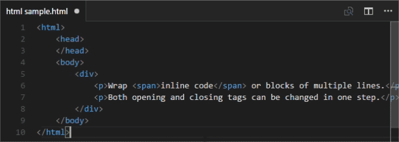

# vscode-htmltagwrap

## What is it
Wraps your selection in HTML tags.  Can wrap an inline selection or a selection of multiple lines.

To use, select a chunk of code and press **"Alt + W" ("Option + W" for Mac).**

[Download it on the Visual Studio Marketplace](https://marketplace.visualstudio.com/items/bradgashler.htmltagwrap)

## How to Use It
Select a block of text or a string of text.  Press <kbd>Alt</kbd> + <kbd>W</kbd> or <kbd>Option</kbd> + <kbd>W</kbd> for Mac.  Type the tag name you want, and it will populate the beginning and end tag automatically.

This extension works best in files that either use tabs or spaces for indentation.  It may not work as well with mixed tabs/spaces.

## Report Issues
I welcome pull requests.  Please report an issue on GitHub if you have trouble.

## Updates
### 0.0.3
* Spaces and tabs for indentation are now both supported.
    - Special thanks to @gdziadkiewicz for his PR #4, which also introduced tests for development!

## Future features being explored
- #5 Once a user hits spacebar, then the second multi-cursor is lost so the user can write attributes like classes or styles. (Idea courtesy of Ruben Rios)
- Should we support `getSelections()` allowing multiple selections to be wrapped?
